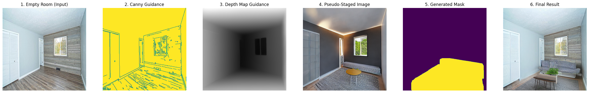
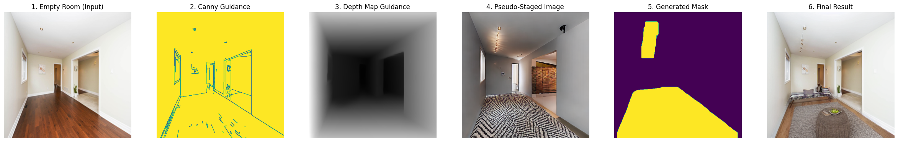

# Virtual Staging

This project leverages a powerful pipeline of generative AI models to perform virtual staging on empty room images. The primary goal is to create high-quality, photorealistic staged interior designs while meticulously preserving the original room's structural integrity and 3D geometry.

## Approach

Our approach is built around a synergistic, multi-stage process, where each component is chosen for its specific strengths in achieving geometrically accurate and aesthetically pleasing results.
<p><strong>Train:</strong>
  <a href="https://www.kaggle.com/code/mithunparab/virtual-staging-stable-diffusion" target="_blank" style="margin-left: 10px; vertical-align: middle;">
    
  </a>
</p>

<p><strong>Run with Gradio UI:</strong>
  <a href="https://www.kaggle.com/code/mithunparab/virtual-staging-gradio" target="_blank" style="margin-left: 10px;">
    
  </a>
  <a href="https://huggingface.co/spaces/Nightfury16/virtual-staging" target="_blank" style="margin-left: 10px;">
    
  </a>
</p>

### 1. Data Preparation: High-Quality Mask Generation

Creating accurate masks for training is crucial. We employ a robust pipeline that uses a state-of-the-art vision-language model (Grounding DINO) to guide a precise segmentation model (SAM).

1. **Creative Layout Generation:** A Stable Diffusion model, guided by Canny edges, depth maps, and your trained inpainting ControlNet, generates an initial "pseudo-staged" image. This creative step populates the room with furniture according to the prompt.
2. **Text-Guided Masking:** Grounding DINO, a specialized object detection model, is used to identify and locate objects (like sofas, tables, chairs) within the generated pseudo-staged image based on text prompts (e.g., "sofa . table . chair").
3. **Pixel-Perfect Segmentation:** The bounding boxes provided by Grounding DINO are then fed to SAM (Segment Anything Model), which generates precise, pixel-level masks for each detected object. These masks form the high-quality training data.

### 2. Training Strategy: Single-Phase ControlNet Training with LoRA Fine-tuning

We employ a single-phase training strategy for our ControlNet, focusing on fine-tuning a pre-trained ControlNet model with an integrated LoRA. This approach leverages existing powerful models and adapts them to our specific virtual staging task.

1.  **ControlNet Fine-tuning with Pre-trained LoRA:**
    The core of our training involves taking a pre-trained ControlNet model (e.g., for inpainting) and fine-tuning its weights on our prepared paired dataset. Crucially, this process also integrates and fine-tunes a pre-trained LoRA (Low-Rank Adaptation) model. The base ControlNet provides structural guidance, while the LoRA injects the desired stylistic and aesthetic qualities (e.g., specific furniture styles, lighting moods, or artistic filters) learned from a separate dataset. This allows the model to learn how to apply the LoRA's style while respecting the structural constraints provided by the ControlNet and the input conditioning image.

    This consolidated fine-tuning phase directly trains the model to understand how to render staged rooms based on the provided structural cues (agnostic image) and the desired stylistic essence from the LoRA, all while aiming for realistic and complete furniture arrangements.
### 3. Inference: Single-Pass Structural Integrity

The inference process focuses on delivering a final, high-quality staged image directly, without intermediate unreliable steps.

1. **Structural Analysis:** The input empty room image is processed to extract a **Canny edge map** (preserving sharp lines like walls and windows) and a **Depth map** (preserving 3D geometry and perspective).
2. **Multi-ControlNet Guidance:** A single Stable Diffusion generation pass is performed using a powerful combination of ControlNets:
    * **Your Trained Inpainting ControlNet:** Used with the empty room image to inject the learned furniture styles and aesthetics.
    * **Canny ControlNet:** Used with the Canny edge map to enforce the room's existing lines.
    * **Depth ControlNet:** Used with the Depth map to ensure correct 3D layout and perspective.
3. **Targeted Inpainting:** A "staging area" mask, programmatically derived from the depth map (e.g., segmenting the floor), is used to guide the generation. This mask focuses the creative process precisely where furniture should appear, preventing unwanted changes to walls or ceilings and ensuring consistency.

## Setup & Workflow

Ensure you have the necessary libraries installed from `requirements.txt` and the GroundingDINO repository cloned with its weights checkout [setup-gdino-kaggle.sh](setup-gdino-kaggle.sh).

```bash
pip install uv
uv pip install -r requirements.txt
```

The entire workflow, from data preparation to training and inference, is orchestrated by the [test.sh](test.sh) script. Please refer to this file for the exact commands and execution order.

## Results

<p align="center">
    <br>
    <br>
    <br>
    <em>Figure 1: Examples of virtual staging outputs. The staged images preserve the original room's geometry while creatively adding realistic furniture and decor based on text prompts.</em>
</p>

## Outlook & Future Work

This project provides a robust foundation. Areas for future development include:

* [ ] **High-Resolution Scaling:** Adapt the pipeline for SDXL models (1024x1024) to achieve production-level image resolution.
* [x] **User Interface (UI):** Develop a Gradio or web-based UI for easy use by non-technical users (e.g., real estate agents).
* [ ] **Advanced Control:** Implement finer control over object placement, style blending, and negative constraints (e.g., "no modern art").
* [ ] **Intelligent Masking:** Explore adaptive masking strategies that can better handle partially furnished rooms or more complex room layouts.
