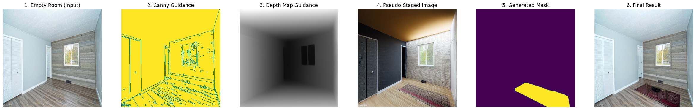

# Virtual Staging

This project leverages a powerful pipeline of generative AI models to perform virtual staging on empty room images. The primary goal is to create high-quality, photorealistic staged interior designs while meticulously preserving the original room's structural integrity and 3D geometry.

## Approach

Our approach is built around a synergistic, multi-stage process, where each component is chosen for its specific strengths in achieving geometrically accurate and aesthetically pleasing results.

<div style="display: flex; align-items: center; gap: 10px;">
    <a href="https://www.kaggle.com/code/mithunparab/virtual-staging-stable-diffusion" target="_blank">
        
    </a>
</div>

### 1. Data Preparation: High-Quality Mask Generation

Creating accurate masks for training is crucial. We employ a robust pipeline that uses a state-of-the-art vision-language model (Grounding DINO) to guide a precise segmentation model (SAM).

1.  **Creative Layout Generation:** A Stable Diffusion model, guided by Canny edges, depth maps, and your trained inpainting ControlNet, generates an initial "pseudo-staged" image. This creative step populates the room with furniture according to the prompt.
2.  **Text-Guided Masking:** Grounding DINO, a specialized object detection model, is used to identify and locate objects (like sofas, tables, chairs) within the generated pseudo-staged image based on text prompts (e.g., "sofa . table . chair").
3.  **Pixel-Perfect Segmentation:** The bounding boxes provided by Grounding DINO are then fed to SAM (Segment Anything Model), which generates precise, pixel-level masks for each detected object. These masks form the high-quality training data.

### 2. Training Strategy: Two-Phase Learning for Control

We use a two-phase training strategy to build a highly effective ControlNet:

1.  **Unpaired Pre-training :** The ControlNet is first trained on a large dataset of *staged room images* (without paired empty rooms). This phase teaches the model a broad visual vocabulary of furniture styles, lighting, textures, and realistic interior aesthetics. It learns "what good staging looks like" in general.
2.  **Paired Fine-tuning :** The pre-trained ControlNet is then fine-tuned on a dataset of *paired empty room and staged room images*. This phase teaches the model the critical skill of applying its learned artistic knowledge while strictly adhering to the structure, walls, windows, and lighting of the original empty room.

### 3. Inference: Single-Pass Structural Integrity

The inference process focuses on delivering a final, high-quality staged image directly, without intermediate unreliable steps.

1.  **Structural Analysis:** The input empty room image is processed to extract a **Canny edge map** (preserving sharp lines like walls and windows) and a **Depth map** (preserving 3D geometry and perspective).
2.  **Multi-ControlNet Guidance:** A single Stable Diffusion generation pass is performed using a powerful combination of ControlNets:
    *   **Your Trained Inpainting ControlNet:** Used with the empty room image to inject the learned furniture styles and aesthetics.
    *   **Canny ControlNet:** Used with the Canny edge map to enforce the room's existing lines.
    *   **Depth ControlNet:** Used with the Depth map to ensure correct 3D layout and perspective.
3.  **Targeted Inpainting:** A "staging area" mask, programmatically derived from the depth map (e.g., segmenting the floor), is used to guide the generation. This mask focuses the creative process precisely where furniture should appear, preventing unwanted changes to walls or ceilings and ensuring consistency.

## Setup & Workflow
Ensure you have the necessary libraries installed from `requirements.txt` and the GroundingDINO repository cloned with its weights checkout [setup-gdino-kaggle.sh](setup-gdino-kaggle.sh).

```bash
pip install uv
uv pip install -r requirements.txt
```

The entire workflow, from data preparation to training and inference, is orchestrated by the [test.sh](test.sh) script. Please refer to this file for the exact commands and execution order.

## Results
<p align="center">
    <br>
    <br>
    <br>
    <em>Figure 1: Examples of virtual staging outputs. The staged images preserve the original room's geometry while creatively adding realistic furniture and decor based on text prompts.</em>
</p>

## Outlook & Future Work

This project provides a robust foundation. Areas for future development include:

*   [ ] **High-Resolution Scaling:** Adapt the pipeline for SDXL models (1024x1024) to achieve production-level image resolution.
*   [ ] **User Interface (UI):** Develop a Gradio or web-based UI for easy use by non-technical users (e.g., real estate agents).
*   [ ] **Advanced Control:** Implement finer control over object placement, style blending, and negative constraints (e.g., "no modern art").
*   [ ] **Intelligent Masking:** Explore adaptive masking strategies that can better handle partially furnished rooms or more complex room layouts.